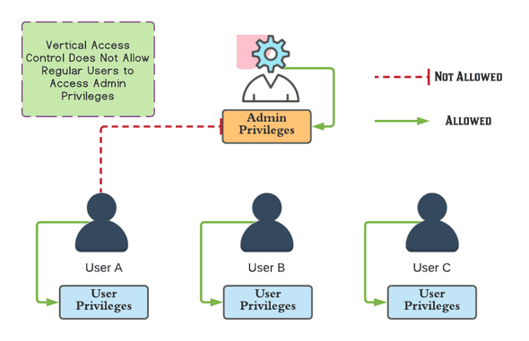
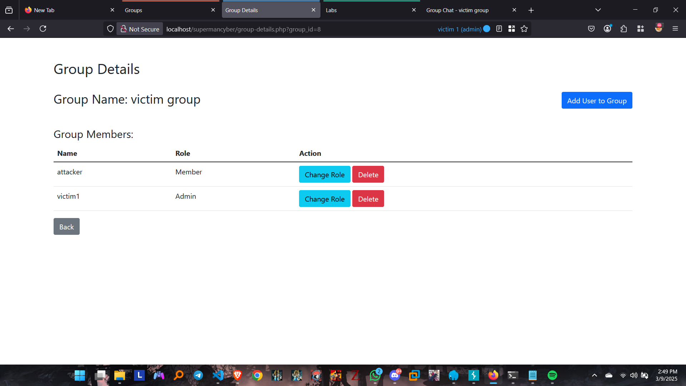

# **Broken Access Control Vulnerability Report**
**Tools Used : Burp Suite, FoxyProxy, Firefox Multi-Account Containers**

### **Apa itu Broken Access Control (BAC)?**

**Broken Access Control** terjadi ketika sistem gagal memvalidasi izin pengguna, memungkinkan akses ke resource yang seharusnya dibatasi. Kerentanan ini masuk **OWASP Top 10** karena memungkinkan:

-   **IDOR** : Manipulasi parameter (e.g., `user_id=123`) untuk mengakses data orang lain.
-   **Privilege Escalation** : Pengguna biasa bisa melakukan aksi admin (e.g., hapus grup, ubah role).

### **Persiapan Testing**

**1. Siapkan 3 Akun** :

-   **Attacker** : Akun untuk melakukan exploitasi.
-   **Victim1** : Akun target utama (pemilik grup yang akan dimanipulasi).
-   **Victim2** : Akun tambahan (opsional, untuk testing penambahan/penghapusan anggota).

**2. Login dengan Firefox Multi-Account Containers** :

-   Buka Firefox dan pasang ekstensi **Multi-Account Containers** .
-   Buat 3 container berbeda untuk memisahkan sesi:
    
    -   Container **Merah** untuk Attacker.
    -   Container **Biru** untuk Victim1.
    -   Container **Hijau** untuk Victim2.
    
-   Login ke masing-masing akun di container yang sesuai.
    -   Screenshot: Tampilan 3 container dengan akun terpisah.
        .png)
        
         

        .png) 

         
    
        .png) 

**3. Konfigurasi Proxy** :

-   Aktifkan **FoxyProxy** untuk mengarahkan traffic ke Burp Suite.
-   Pastikan semua request dari ketiga container melalui Burp Suite.

 
 

## **1. Privilege Escalation - Clear Chat**

**Endpoint** : `/clear-chat`  
**Severity** : High

### **Steps to Reproduce** :

1.  **Victim Membuat Grup**
    
    -   Victim membuat grup baru dan mengundang attacker sebagai anggota.
     
     
    -   Screenshot: Victim mengundang attacker ke grup
    
    
2.  **Intercept Request Clear Chat**
   
    -   Victim membuka grup, lalu lakukan clear chat.
    -   Tangkap request menggunakan Burp Suite dan simpan di Repeater dengan nama **"victim_clear_chat"** .
     
     
    -   Screenshot: Request clear chat dari victim di Burp Repeater.
    .png)
    
3.  **Intercept Request Chat Attacker**
    
    
    -   Attacker mengirim pesan ke grup victim, 
    .png)
    lalu tangkap request di Burp Suite dan simpan di Repeater dengan nama **"attacker_send_chat"** .
    
4.  **Manipulasi Request**
    
    -   Copy header request **"attacker_send_chat"** dan tempel ke header request **"victim_clear_chat"** .
    -   Kirim request yang telah dimodifikasi.
    -   Screenshot: Request yang telah dimodifikasi di Burp Repeater.
    .png)

5.  **Verifikasi**
    
    -   Reload halaman grup victim: **Chat grup victim terhapus** meskipun attacker tidak memiliki izin.
    -   Screenshot: Chat grup punya victim kosong setelah exploit.
    .png)
----------
 
 

## **2. IDOR - Update Role**

**Endpoint** : `/update-role`  
**Severity** : Critical

### **Steps to Reproduce** :

1.  **Persiapan**
    
    -   Victim membuat grup dan menambahkan attacker sebagai anggota (ID attacker: `1`).
    -   Catat **group_id** milik victim dari URL detail group.
    -   Screenshot: Group ID victim di URL.
    

2.  **Attacker Update Role di Grupnya Sendiri**
    
    -   Attacker membuat grup dan mengubah role anggota dari "member" ke "admin".
    -   Tangkap request di Burp Suite dan simpan di Repeater dengan nama **"attacker_update_role"** .
    
3.  **Manipulasi Request**
    
    -   Ubah parameter `group_id` ke **group_id victim** dan `user_id` ke **ID attacker** .
    -   Kirim request yang telah dimodifikasi.
    -   Screenshot: Request dengan group_id dan user_id yang diubah.
    .png)
    
4.  **Verifikasi**
    
    -   Buka detail grup victim: Attacker sekarang memiliki role **admin** di grup victim.
    -   Screenshot: Attacker sebagai admin di grup victim.
    .png)
----------

## **3. IDOR - Update Group**

**Endpoint** : `/update-group`  
**Severity** : High

### **Steps to Reproduce** :

1.  **Victim Update Grup**
    
    -   Victim mengubah nama grupnya. Tangkap request di Burp Suite dan simpan body-nya.
     
     
    -   Screenshot: Request update grup dari victim.
    .png)
    
2.  **Attacker Update Grupnya Sendiri**
    
    -   Attacker mengubah nama grupnya sendiri. Tangkap request di Burp Suite dan simpan di Repeater dengan nama **"attacker_update_group"** .
    
3.  **Manipulasi Request**
    
    -   Ganti body request attacker dengan body request victim, lalu ubah `group_name` menjadi **"hackbyattacker"** .
    -   Kirim request yang telah dimodifikasi.
     
     
    -   Screenshot: Request yang dimodifikasi di Repeater.
    .png)

4.  **Verifikasi**
    
    -   Nama grup victim berubah menjadi **"hackbyattacker"** .
     
     
    -   Screenshot: Nama grup victim setelah diubah.
    .png)
----------

## **4. IDOR - Delete Group**

**Endpoint** : `/delete-group`  
**Severity** : Critical

### **Steps to Reproduce** :

1.  **Attacker Delete Grup Sendiri**
    
    -   Attacker menghapus grupnya sendiri. Tangkap request di Burp Suite dan simpan di Repeater dengan nama **"attacker_delete_group"** .
    
2.  **Manipulasi Request**
    
    -   Ubah `group_id` ke **group_id victim** .
    -   Kirim request yang telah dimodifikasi.
    -   Screenshot: Request dengan group_id victim.
    .png)
    
3.  **Verifikasi**
    
    -   Grup victim tidak lagi muncul di daftar grup.
    -   Screenshot: Daftar grup victim yang kosong.
    .png)
----------

## **5. IDOR - Add User to Group**

**Endpoint** : `/add-user`  
**Severity** : Medium

### **Steps to Reproduce** :

1.  **Attacker Menambahkan User ke Grupnya Sendiri**
    
    -   Attacker menambahkan user lain ke grupnya. Tangkap request di Burp Suite dan simpan di Repeater dengan nama **"attacker_add_user"** .
    
2.  **Manipulasi Request**
    
    -   Ubah `group_id` ke **group_id victim** .
    -   Kirim request yang telah dimodifikasi.
    -   Screenshot: Request dengan group_id victim.
    .png)
    
3.  **Verifikasi**
    
    -   User yang ditambahkan muncul di grup victim.
    -   Screenshot: User baru di grup victim.
    .png) 
----------

## **6. IDOR - Remove User from Group**

**Endpoint** : `/remove-user`  
**Severity** : Medium-High

### **Steps to Reproduce** :

1.  **Attacker Menghapus User dari Grupnya Sendiri**
    
    -   Attacker menghapus user dari grupnya. Tangkap request di Burp Suite dan simpan di Repeater dengan nama **"attacker_delete_user"** .
    
2.  **Manipulasi Request**
    
    -   Ubah `group_id` ke **group_id victim** .
    -   Kirim request yang telah dimodifikasi.
    -   Screenshot: Request dengan group_id victim.
    

3.  **Verifikasi**
    
    -   User yang ditargetkan hilang dari grup victim.
    -   Screenshot: User tidak ada di grup victim.
    .png) 
----------

## **Impact**

-   **Critical** : Attacker dapat mengambil alih grup, menghapus data, atau menaikkan hak akses.
-   **High** : Perubahan data sensitif (nama grup, chat) tanpa izin.
-   **Medium** : Manipulasi keanggotaan grup.

----------

## **Recommendation**

1.  Validasi izin pengguna pada setiap endpoint sensitif (e.g., cek apakah user adalah admin grup).
2.  Implementasi **server-side checks** untuk memastikan user hanya bisa mengakses resource yang dimilikinya.
3.  Gunakan **UUID** sebagai pengganti ID numerik untuk mencegah IDOR.

----------
