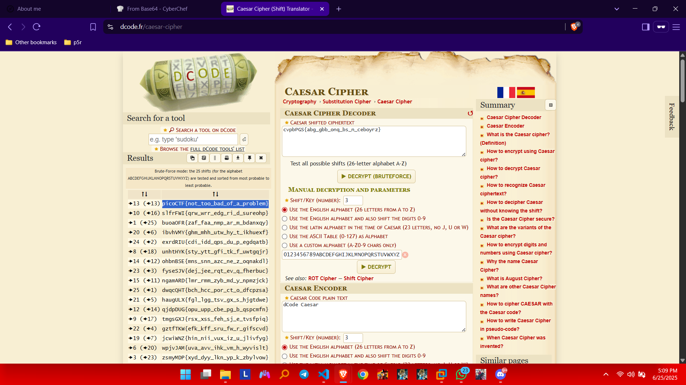

##  CTF Name: 13 (Easy)

### Description:
Cryptography can be easy, do you know what ROT13 is? `cvpbPGS{abg_gbb_onq_bs_n_ceboyrz}`

### Hint:
This can be solved online if you don't want to do it by hand!

### Analysis:
ROT13 is a simple Caesar Cipher variant that replaces each letter with the one 13 positions ahead in the alphabet. Since the English alphabet has 26 letters, applying ROT13 twice returns the original message.

The provided ciphertext uses ROT13, so we only need to decode it once.

### Solution:
I used an online decoder like [Caesar Chipher](https://www.dcode.fr/caesar-cipher) to decode the text:

### Flag:
**picoCTF{not_too_bad_of_a_problem}**
