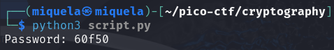

##  CTF Name: rsa_oracle (medium)

### Description:
Can you abuse the oracle?
An attacker was able to intercept communications between a bank and a fintech company. They managed to get the message (ciphertext) and the password that was used to encrypt the message.
### Hint:

 1. Crytography Threat models: chosen plaintext attack.
 2. OpenSSL can be used to decrypt the message. e.g `openssl enc -aes-256-cbc -d ...`
 3. The key to getting the flag is by sending a custom message to the server by taking advantage of the RSA encryption algorithm.
 4. Minimum requirements for a useful cryptosystem is CPA security.

### Solution:
Pada tantangan kali ini diberikan 2 file yaitu secret.enc dan password.enc setelah saya cek isi file tersebut abstrak sepertinya menggunakan enskripsi, saya mencoba untuk membuka server yang disediakan oleh challenge ini

setelah saya mencoba untuk menenskripsi teks "akusukamakanayam" hasil encode nya itu menggunakan chipertext yang berarti metode untuk enskripsi nya ini menggunakan RSA (Rivest–Shamir–Adleman) asumsi saya saya harus mendecode password.enc untuk mendapatkan password yang digunakan untuk membuka secret.enc saya menemukan [referensi](https://crypto.stackexchange.com/questions/2323/how-does-a-chosen-plaintext-attack-on-rsa-work/2331#2331)  cara untuk mengeksploitasi keamanan rsa ini menggunakan chosen plaintext attack langkah-langkah nya sebagai berikut:

 1. **Membuat skrip python untuk melakukan chosen plaintext attack** 
	 
	 
	 
	Skrip ini merupakan eksploitasi terhadap sistem enkripsi di server remote menggunakan library pwntools. Skrip terhubung ke server nya disediakan di tantangan ini dan membaca nilai terenkripsi dari file password.enc. Skrip ini kemudian berinteraksi dengan server menggunakan mode encrypt (E) dan decrypt (D) untuk mengeksploitasi kelemahan RSA. Dengan mengirimkan E dan \x02, skrip mendapatkan nilai c_a, yaitu hasil enkripsi angka 2. Selanjutnya, dengan mengirimkan D terhadap hasil perkalian c_a * c, skrip mengeksploitasi sifat perkalian pada multiplicative property RSA untuk memperoleh password yang didekripsi, kemudian dikonversi ke bentuk string dan dicetak.

2.  **Menjalankan script.py menggunakan python3**

	

	setelah menjalankan script ini saya mendapatkan password asli nya **(60f50)** yang digunakan untuk membuka secret.enc 

3. **Membuka secret.enc dengan password yang sudah didapatkan menggunakan openssl**

	

	setelah memasukan passwordnya saya mendapatkan flag yang saya cari yaitu: **picoCTF{su((3ss_(r@ck1ng_r3@_60f50766}** 

