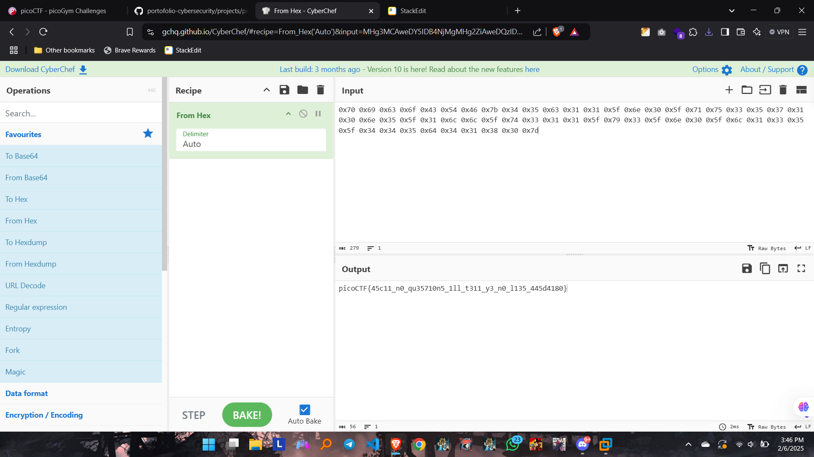

##  CTF Name: ASCII Numbers (medium)

### Description:
Convert the following string of ASCII numbers into a readable string:
0x70 0x69 0x63 0x6f 0x43 0x54 0x46 0x7b 0x34 0x35 0x63 0x31 0x31 0x5f 0x6e 0x30 0x5f 0x71 0x75 0x33 0x35 0x37 0x31 0x30 0x6e 0x35 0x5f 0x31 0x6c 0x6c 0x5f 0x74 0x33 0x31 0x31 0x5f 0x79 0x33 0x5f 0x6e 0x30 0x5f 0x6c 0x31 0x33 0x35 0x5f 0x34 0x34 0x35 0x64 0x34 0x31 0x38 0x30 0x7d

### Hint:

 1. CyberChef is a great tool for any encoding but especially ASCII.
 2. Try CyberChef's 'From Hex' function

### Analysis
tantangan ini cukup mudah hanya tinggal convert asci itu menggunakan from hex di cyberchef

### Solution:

 1. Mendecode ascii yang diberikan menggunakan fungsi From Hex di website CyberChef

	

	setelah berhasil mendecode asci tersebut didapatkan flagnya yaitu:
**picoCTF{45c11_n0_qu35710n5_1ll_t311_y3_n0_l135_445d4180}**

