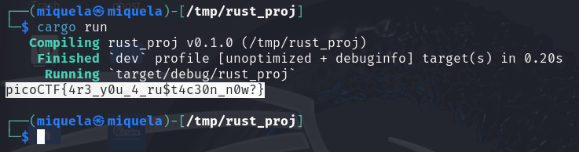

##  CTF Name: Rust Fixme 1 (Easy)

### Description:
Have you heard of Rust? Fix the syntax errors in this Rust file to print the flag!

### Hint:
1. Cargo is Rust's package manager and will make your life easier. See the getting started page [here](https://doc.rust-lang.org/book/ch01-03-hello-cargo.html)
2. [println!](https://doc.rust-lang.org/std/macro.println.html)
3. Rust has some pretty great compiler error messages. Read them maybe?

### Analysis:
Typical Rust syntax issues to address include adding a semicolon (`;`) at the end of statements, replacing `ret;` with `return;`, and using the `{}` placeholder in `println!` to display variables. Once these fixes are applied, the XOR-decryption code runs and reveals the flag

### Solution:
1. **Ekstrak file challenge:**

	

2. **Install Rust & Cargo:**

	``curl --proto '=https' --tlsv1.2 -sSf https://sh.rustup.rs | sh
source "$HOME/.cargo/env"``

	

	
3.  **Run the original code (before fixes):**

	``cp -r fixme1 /tmp/rust_proj``  
	``cd /tmp/rust_proj``  
	``cargo build``  
	``cargo run	``

	You'll see errors like:

	

	These pinpoint exactly what needs fixing
		
4. **Fix source code `src/main.rs`:**
	
	``sudo nano /src/main.rs``

	
	
5. **Rebuild & run:**
	
	

### Flag:
**picoCTF{4r3_y0u_4_ru$t4c30n_n0w?}**
