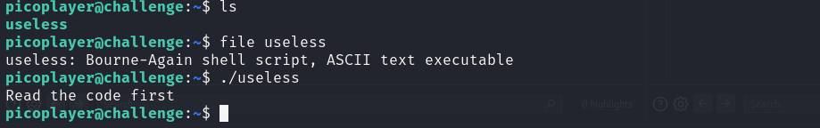

##  CTF Name: useless (medium)

### Description:
There's an interesting script in the user's home directoryThe work computer is running SSH. We've been given a script which performs some basic calculations, explore the script and find a flag.

### Hint:
(none)

### Analysis:
setelah menjalankan tantangan ini diberikan detail tambahan:
Hostname: saturn.picoctf.net
Port:     57551
Username: picoplayer
Password: password

seperti nya ini adalah detail dari server yang bisa kita hubungkan melalui ssh

### Solution:
1. connect ke server menggunakan ssh -p 57551 picoplayer@saturn.picoctf.net dan masukkan password tadi

	
	
2. Setelah berhasil terhubung ke server hal pertama yang saya lakukan adalah mengecek direktori yang ada dengan menggunakan ls, terdapat file useless yang ketika saya cek jenis file nya itu merupakan file executable

	
	setelah saya run file ./useless diminta untuk membaca file tersebut

3. Membaca file useless menggunakan cat

	

	saya notice terdapat hal menarik pada bagian else terakhir echo "read the manual" sepertinya diminta untuk membaca manual page dari file ini 

4. Membaca manual page dari file tersebut menggunakan command man useless

	

	pada manual page ini terdapat flag yang saya cari di bagian author yaitu:
	**picoCTF{us3l3ss_ch4ll3ng3_3xpl0it3d_5657}**
