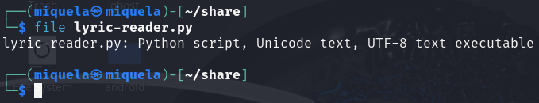

##  CTF Name: Flag Hunters (Easy)

### Description:
Lyrics jump from verses to the refrain kind of like a subroutine call. There's a hidden refrain this program doesn't print by default. Can you get it to print it? There might be something in it for you.

### Hint:
1. This program can easily get into undefined states. Don't be shy about Ctrl-C.
2.  Unsanitized user input is always good, right?
3. Is there any syntax that is ripe for subversion?

### Analysis:
The script reads `some strings` into `secret_intro`, which is prepended to the song. But `reader(..., '[VERSE1]')` starts at `[VERSE1]`, skipping the flag section. During execution, when the script encounters a `CROWD` line, it replaces that line with user input. This input is split by `;`, so you can inject something like `;RETURN 0`. When processed, `RETURN 0` jumps the pointer `lip` to line 0, and the script then prints the intro containing the flag

### Solution:
1. **Download the source code:**
	
	

2.  **Analyze source code & exploit logic input:**

	The flag is prepended into the lyrics via `secret_intro`, but the `reader()` function starts reading from `[VERSE1]`, **skipping** the flag section entirely.

	
	
	When the script encounters a `CROWD` line, it asks for user input:

	

	The input is then **split by `;`**, and each segment is processed. If one of the segments is `RETURN <n>`, the reader will **jump to line** So, if we input `test;RETURN 0`, the script will:

	-   replace the current line with our input,
	    
	-   process `some strings` (ignored),
	    
	-   and then jump to line `0`, which contains the `secret_intro` and the flag.

3.  **Connect via netcat:**
	
	``nc verbal-sleep.picoctf.net 51134``

4.  ****Wait for script to reach first `Crowd:` prompt**, then provide:**

	
	
5. ****The script will jump** to line 0, printing the secret intro, including flag:**

	

### Flag:
**picoCTF{70637h3r_f0r3v3r_ac197d12}**
