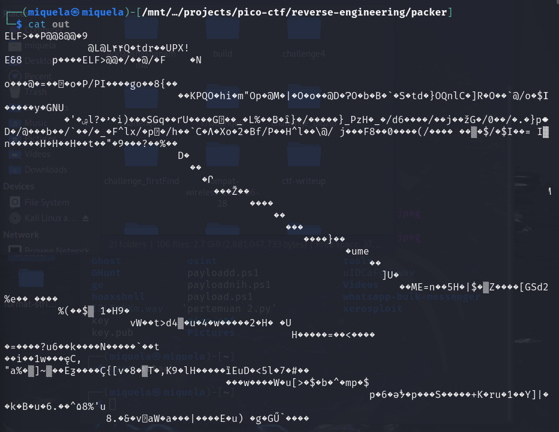
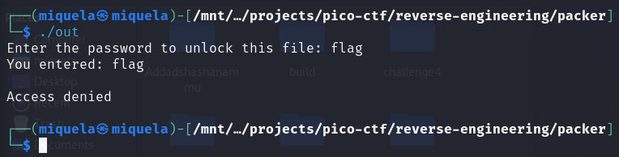

##  CTF Name: packer (medium)

### Description:
Reverse this linux executable?

### Hint:
What can we do to reduce the size of a binary after compiling it.

### Analysis
Pada tantangan kali ini diberikan file 1 file binary yang ketika saya baca file nya menggunakan cat file tersebut tidak bisa dibaca oleh manusia 

strategi saya disini saya akan membongkar binary ini agar isinya bisa saya lihat langkah-langkahnya sebagai berikut:

### Solution:

 1. **Langkah pertama adalah menganalisa file binary yang sudah di download menggunakan command file out**

	

	pada file out itu ternyata file itu merupakan file 64 bit yang bisa dieksekusi di os linux

2. **Menjalankan file out itu dengan command ./out**

	

	setelah saya jalankan file out itu diminta untuk memasukan password agar bisa mendapatkan flag nya

3. **Mengekstrak data dari file out menggunakan command strings out agar bisa dibaca oleh manusia**

	

	setelah saya ekstrak file out itu terdapat hal menarik disini ternyata file binary ini dipaketkan menggunakan UPX (Ultimate Packer for Executables)

4. **Membongkar paket file out ini menggunakan command upx -d out**

	

	damn paketnya berhasil dibongkar dan file nya kembali ke bentuk aslinya 

5. **Melihat lagi data dari file out menggunakan strings dan mencoba langsung mencari flag di dalam nya menggunakan grep**

	

	
	
	setelah di cek menggunakan strings isi dari file ini sudah bisa dibaca oleh manusia dan saya juga mendapat data yang mengandung flag di dalam nya tapi flag tersebut harus di encode terlebih dahulu

6. **Mendecode flag yang sudah didapatkan menggunakan cyberchef**

	.png)

	setelah mendecode flag nya menggunakan magic decode cyberchef flag tersebut di encode menggunakan hex setelah itu didapatkan flag nya yaitu: **picoCTF{U9X_UnP4ck1N6_B1n4Ri3S_371aa9ff}**

	
	
