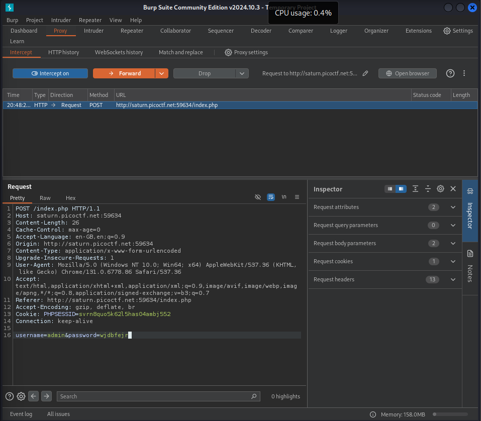
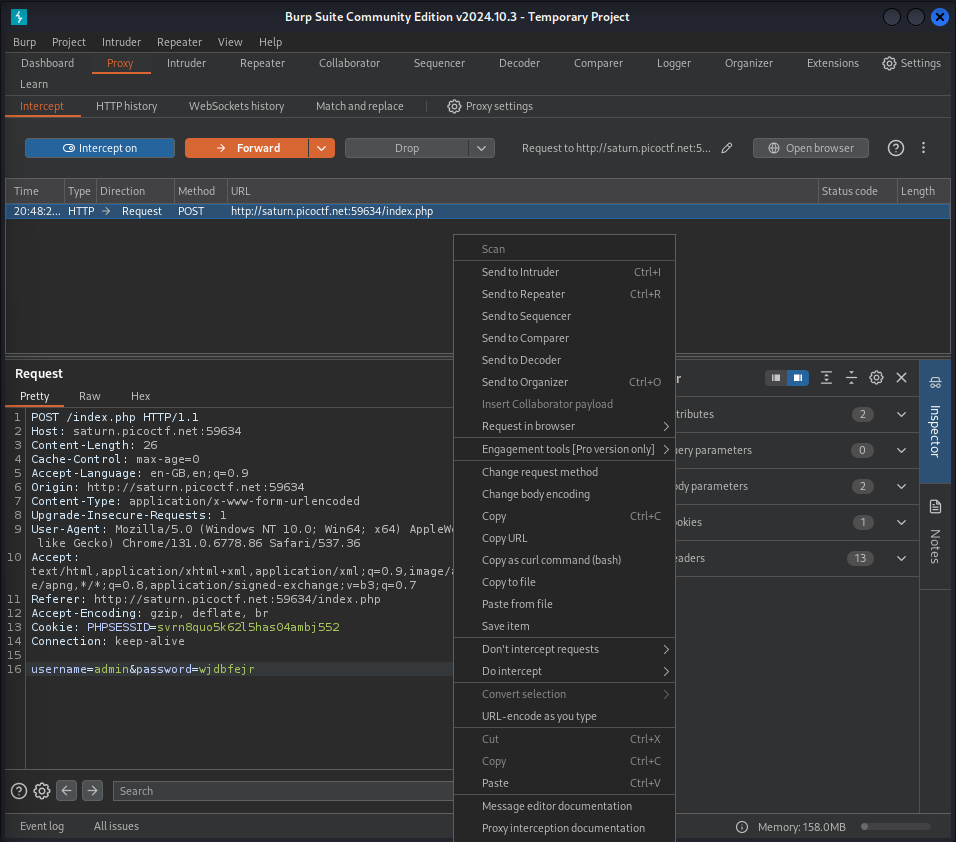

##  CTF Name: More SQLi (medium)

### Description:
Can you find the flag on this website.

### Hint:
SQLiLite

### Analysis:
Pada tantangan kali ini diberikan sebuah website yang rentan terhadap sql injection berikut langkah eksploitasi nya:

### Solution:

1. **Mengetes input website untuk memastikan apakah inputnya di validasi atau tidak**

	.png)

	.png)

	setelah saya coba memasukan input normal saja ketika login malah ke halaman yang mengembalikan query sql yang saya inputkan tadi dengan ini jelas input di website ini tidak divalidasi dan bisa dilakukan sql injection

 

2. **Menggunakan burpsuite untuk melihat request dan respond yang ada di website**

	
	
	 

	

	setelah respon login di website itu ditangkap oleh burpsuite dikirimkan ke repeater untuk di ubah request nya.

 

3. **Memasukan payload (' OR 1=1; -- -) pada input password dan mengirimkan request ke repeater lalu melihat respondnya di repeater**

	

	setelah saya memasukan payload saya berhasil login karena payload ' OR 1=1; -- - menutup string input, menambahkan kondisi OR 1=1 (selalu TRUE), lalu mengabaikan sisa query dengan --, sehingga login atau query lainnya tetap berhasil tanpa validasi, dan pada respon yang dikirim ke repeater terdapat flag nya berada di dalam paragraf flag nya yaitu: **picoCTF{G3tting_5QL_1nJ3c7I0N_l1k3_y0u_sh0ulD_3b0fca37}**
