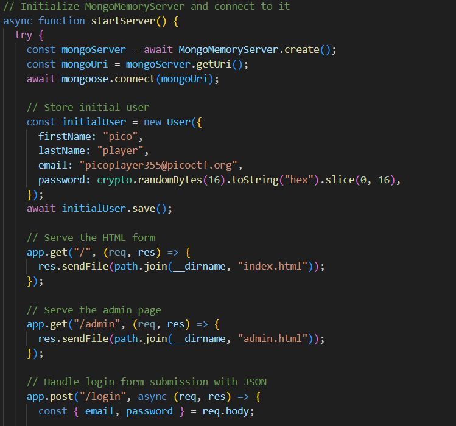

##  CTF Name: No SQL Injection (Medium)

### Description:
Can you try to get access to this website to get the flag?

### Hint:
 1. Not only SQL injection exist but also NonSQL injection exists.
 2. Make sure you look at everything the server is sending back.

### Solution:
pada challenge kali ini diberikan file app.tar.gz yang ketika di ekstrak itu berisi source code dari tantangan ini ada file menarik pada folder ini yaitu server.js, ketika saya buka server.js ternyata ini adalah database mongo-db dari web ini pada file ini terdapat email dan password untuk mengakses halaman admin akan tetapi password nya itu dienskripsi

challenge ini tidak menggunakan sql injection seperti xss,dll untuk menyelesaikan masalah ini saya menggunakan metode exploitasi dengan  [referensi](https://portswigger.net/web-security/nosql-injection) dari sini langkah-langkah yang saya lakukan adalah:

 1. **Membuka link web yang sudah disediakan pada challenge ini http://atlas.picoctf.net:64686/**

	.png)

	 dan saya memasukan email yang saya temukan di server.js tadi **picoplayer355@picoctf.org** dan pada bagian password saya memasukan payload 
{**"%ne" : "null"}**  payload ini membuat query akan mengembalikan nilai user selama password tidak kosong.

2. **Langkah selanjutnya setelah saya berhasil membypass login admin saya diarahkan ke endpoint /admin** 

	disini saya melihat apakah user admin ini memiliki token atau tidak dengan cara inspect element>application>network

	.png)
	
	setelah saya cek pada bagian token itu terdapat hashing yang menarik yang bisa di decrypt dengan base64

3. **Token yang saya dapatkan saya dekripsi menggunakan web https://www.base64decode.org/**

	

	setelah di dekripsi saya didapatkan flag nya yaitu:
**picoCTF{jBhD2y7XoNzPv_1YxS9Ew5qL0uI6pasql_injection_25ba4de1}**
	
